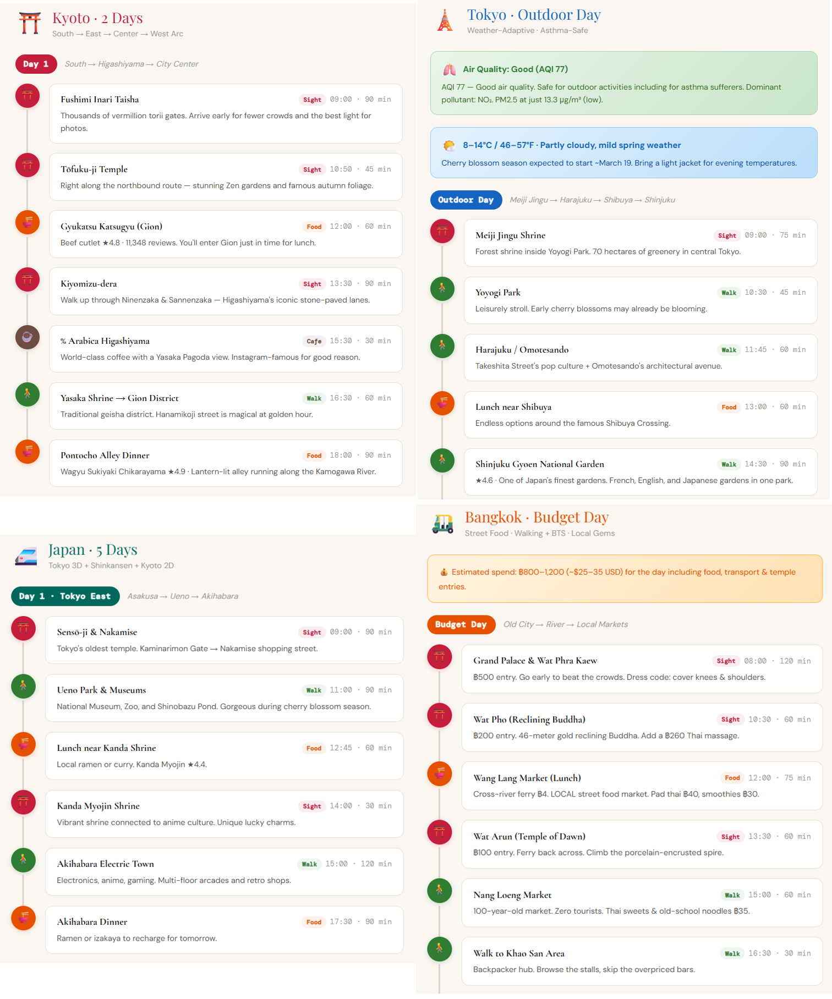

[](https://www.npmjs.com/package/@cablate/mcp-google-map) [](./LICENSE) [](https://www.npmjs.com/package/@cablate/mcp-google-map)

[](https://insiders.vscode.dev/redirect?url=vscode%3Amcp%2Finstall%3F%257B%2522name%2522%253A%2522google-maps%2522%252C%2522command%2522%253A%2522npx%2522%252C%2522args%2522%253A%255B%2522-y%2522%252C%2522%2540cablate%252Fmcp-google-map%2540latest%2522%252C%2522--stdio%2522%255D%252C%2522env%2522%253A%257B%2522GOOGLE_MAPS_API_KEY%2522%253A%2522YOUR_API_KEY%2522%257D%257D) [](https://insiders.vscode.dev/redirect?url=vscode-insiders%3Amcp%2Finstall%3F%257B%2522name%2522%253A%2522google-maps%2522%252C%2522command%2522%253A%2522npx%2522%252C%2522args%2522%253A%255B%2522-y%2522%252C%2522%2540cablate%252Fmcp-google-map%2540latest%2522%252C%2522--stdio%2522%255D%252C%2522env%2522%253A%257B%2522GOOGLE_MAPS_API_KEY%2522%253A%2522YOUR_API_KEY%2522%257D%257D)

# MCP Google Map Server

Give your AI agent the ability to understand the physical world — geocode, route, search, and reason about locations.



- **17 tools** — 14 atomic + 3 composite (explore-area, plan-route, compare-places)
- **3 modes** — stdio, StreamableHTTP, standalone exec CLI
- **Agent Skill** — built-in skill definition teaches AI how to chain geo tools ([`skills/google-maps/`](./skills/google-maps/))

### vs Google Grounding Lite

| | This project | [Grounding Lite](https://cloud.google.com/blog/products/ai-machine-learning/announcing-official-mcp-support-for-google-services) |
|---|---|---|
| Tools | **17** | 3 |
| Geocoding | Yes | No |
| Step-by-step directions | Yes | No |
| Elevation | Yes | No |
| Distance matrix | Yes | No |
| Place details | Yes | No |
| Timezone | Yes | No |
| Weather | Yes | Yes |
| Air quality | Yes | No |
| Map images | Yes | No |
| Composite tools (explore, plan, compare) | Yes | No |
| Open source | MIT | No |
| Self-hosted | Yes | Google-managed only |
| Agent Skill | Yes | No |

### Quick Start

```bash
# stdio (Claude Desktop, Cursor, etc.)
npx @cablate/mcp-google-map --stdio

# exec CLI — no server needed
npx @cablate/mcp-google-map exec geocode '{"address":"Tokyo Tower"}'

# HTTP server
npx @cablate/mcp-google-map --port 3000 --apikey "YOUR_API_KEY"
```

## Special Thanks

Special thanks to [@junyinnnn](https://github.com/junyinnnn) for helping add support for `streamablehttp`.

## Available Tools

| Tool | Description |
|------|-------------|
| `maps_search_nearby` | Find places near a location by type (restaurant, cafe, hotel, etc.). Supports filtering by radius, rating, and open status. |
| `maps_search_places` | Free-text place search (e.g., "sushi restaurants in Tokyo"). Supports location bias, rating, open-now filters. |
| `maps_place_details` | Get full details for a place by its place_id — reviews, phone, website, hours, photos. |
| `maps_geocode` | Convert an address or landmark name into GPS coordinates. |
| `maps_reverse_geocode` | Convert GPS coordinates into a street address. |
| `maps_distance_matrix` | Calculate travel distances and times between multiple origins and destinations. |
| `maps_directions` | Get step-by-step navigation between two points with route details. |
| `maps_elevation` | Get elevation (meters above sea level) for geographic coordinates. |
| `maps_timezone` | Get timezone ID, name, UTC/DST offsets, and local time for coordinates. |
| `maps_weather` | Get current weather conditions or forecast — temperature, humidity, wind, UV, precipitation. |
| `maps_air_quality` | Get air quality index, pollutant concentrations, and health recommendations by demographic group. |
| `maps_static_map` | Generate a map image with markers, paths, or routes — returned inline for the user to see directly. |
| `maps_batch_geocode` | Geocode up to 50 addresses in one call — returns coordinates for each. |
| `maps_search_along_route` | Search for places along a route between two points — ranked by minimal detour time. |
| **Composite Tools** | |
| `maps_explore_area` | Explore what's around a location — searches multiple place types and gets details in one call. |
| `maps_plan_route` | Plan an optimized multi-stop route — geocodes, finds best order, returns directions. |
| `maps_compare_places` | Compare places side-by-side — searches, gets details, and optionally calculates distances. |

All tools are annotated with `readOnlyHint: true` and `destructiveHint: false` — MCP clients can auto-approve these without user confirmation.

> **Prerequisite**: Enable **Places API (New)** in [Google Cloud Console](https://console.cloud.google.com) before using place-related tools.

## Installation

### Method 1: stdio (Recommended for most clients)

Works with Claude Desktop, Cursor, VS Code, and any MCP client that supports stdio:

```json
{
  "mcpServers": {
    "google-maps": {
      "command": "npx",
      "args": ["-y", "@cablate/mcp-google-map", "--stdio"],
      "env": {
        "GOOGLE_MAPS_API_KEY": "YOUR_API_KEY"
      }
    }
  }
}
```

**Reduce context usage** — If you only need a subset of tools, set `GOOGLE_MAPS_ENABLED_TOOLS` to limit which tools are registered:

```json
{
  "env": {
    "GOOGLE_MAPS_API_KEY": "YOUR_API_KEY",
    "GOOGLE_MAPS_ENABLED_TOOLS": "maps_geocode,maps_directions,maps_search_places"
  }
}
```

Omit or set to `*` for all 17 tools (default).

### Method 2: HTTP Server

For multi-session deployments, per-request API key isolation, or remote access:

```bash
npx @cablate/mcp-google-map --port 3000 --apikey "YOUR_API_KEY"
```

Then configure your MCP client:

```json
{
  "mcpServers": {
    "google-maps": {
      "type": "http",
      "url": "http://localhost:3000/mcp"
    }
  }
}
```

### Server Information

- **Transport**: stdio (`--stdio`) or Streamable HTTP (default)
- **Tools**: 17 Google Maps tools (14 atomic + 3 composite) — filterable via `GOOGLE_MAPS_ENABLED_TOOLS`

### CLI Exec Mode (Agent Skill)

Use tools directly without running the MCP server:

```bash
npx @cablate/mcp-google-map exec geocode '{"address":"Tokyo Tower"}'
npx @cablate/mcp-google-map exec search-places '{"query":"ramen in Tokyo"}'
```

All 17 tools available: `geocode`, `reverse-geocode`, `search-nearby`, `search-places`, `place-details`, `directions`, `distance-matrix`, `elevation`, `timezone`, `weather`, `air-quality`, `static-map`, `batch-geocode-tool`, `search-along-route`, `explore-area`, `plan-route`, `compare-places`. See [`skills/google-maps/`](./skills/google-maps/) for the agent skill definition and full parameter docs.

### Batch Geocode

Geocode hundreds of addresses from a file:

```bash
npx @cablate/mcp-google-map batch-geocode -i addresses.txt -o results.json
cat addresses.txt | npx @cablate/mcp-google-map batch-geocode -i -
```

Input: one address per line. Output: JSON with `{ total, succeeded, failed, results[] }`. Default concurrency: 20 parallel requests.


### API Key Configuration

API keys can be provided in three ways (priority order):

1. **HTTP Headers** (Highest priority)

   ```json
   {
     "mcp-google-map": {
       "transport": "streamableHttp",
       "url": "http://localhost:3000/mcp",
       "headers": {
         "X-Google-Maps-API-Key": "YOUR_API_KEY"
       }
     }
   }
   ```

2. **Command Line**

   ```bash
   mcp-google-map --apikey YOUR_API_KEY
   ```

3. **Environment Variable** (.env file or command line)
   ```env
   GOOGLE_MAPS_API_KEY=your_api_key_here
   MCP_SERVER_PORT=3000
   ```

## Development

### Local Development

```bash
# Clone the repository
git clone https://github.com/cablate/mcp-google-map.git
cd mcp-google-map

# Install dependencies
npm install

# Set up environment variables
cp .env.example .env
# Edit .env with your API key

# Build the project
npm run build

# Start the server
npm start

# Or run in development mode
npm run dev
```

### Testing

```bash
# Run smoke tests (no API key required for basic tests)
npm test

# Run full E2E tests (requires GOOGLE_MAPS_API_KEY)
npm run test:e2e
```

### Project Structure

```
src/
├── cli.ts                        # CLI entry point
├── config.ts                     # Tool registration and server config
├── index.ts                      # Package exports
├── core/
│   └── BaseMcpServer.ts          # MCP server with streamable HTTP transport
├── services/
│   ├── NewPlacesService.ts       # Google Places API (New) client
│   ├── PlacesSearcher.ts         # Service facade layer
│   └── toolclass.ts              # Legacy Google Maps API client
├── tools/
│   └── maps/
│       ├── searchNearby.ts       # maps_search_nearby tool
│       ├── searchPlaces.ts       # maps_search_places tool
│       ├── placeDetails.ts       # maps_place_details tool
│       ├── geocode.ts            # maps_geocode tool
│       ├── reverseGeocode.ts     # maps_reverse_geocode tool
│       ├── distanceMatrix.ts     # maps_distance_matrix tool
│       ├── directions.ts         # maps_directions tool
│       ├── elevation.ts          # maps_elevation tool
│       ├── timezone.ts           # maps_timezone tool
│       ├── weather.ts            # maps_weather tool
│       ├── airQuality.ts         # maps_air_quality tool
│       ├── staticMap.ts          # maps_static_map tool
│       ├── batchGeocode.ts       # maps_batch_geocode tool
│       ├── searchAlongRoute.ts   # maps_search_along_route tool
│       ├── exploreArea.ts        # maps_explore_area (composite)
│       ├── planRoute.ts          # maps_plan_route (composite)
│       └── comparePlaces.ts      # maps_compare_places (composite)
└── utils/
    ├── apiKeyManager.ts          # API key management
    └── requestContext.ts         # Per-request context (API key isolation)
tests/
└── smoke.test.ts                 # Smoke + E2E test suite
skills/
├── google-maps/                  # Agent Skill — how to USE the tools
│   ├── SKILL.md                  # Tool map, recipes, invocation
│   └── references/
│       ├── tools-api.md          # Tool parameters + scenario recipes
│       └── travel-planning.md    # Travel planning methodology
└── project-docs/                 # Project Skill — how to DEVELOP/MAINTAIN
    ├── SKILL.md                  # Architecture overview + onboarding
    └── references/
        ├── architecture.md       # System design, code map, 9-file checklist
        ├── google-maps-api-guide.md  # API endpoints, pricing, gotchas
        ├── geo-domain-knowledge.md   # GIS fundamentals, Japan context
        └── decisions.md          # 10 ADRs (design decisions + rationale)
```

## Tech Stack

- **TypeScript** - Type-safe development
- **Node.js** - Runtime environment
- **@googlemaps/places** - Google Places API (New) for place search and details
- **@googlemaps/google-maps-services-js** - Legacy API for geocoding, directions, distance matrix, elevation
- **@modelcontextprotocol/sdk** - MCP protocol implementation (v1.27+)
- **Express.js** - HTTP server framework
- **Zod** - Schema validation

## Security

- API keys are handled server-side
- Per-session API key isolation for multi-tenant deployments
- DNS rebinding protection available for production
- Input validation using Zod schemas

For enterprise security reviews, see [Security Assessment Clarifications](./SECURITY_ASSESSMENT.md) — a 23-item checklist covering licensing, data protection, credential management, tool contamination, and AI agent execution environment verification.

## Roadmap

### Recent Additions

| Tool / Feature | What it unlocks | Status |
|------|----------------|--------|
| `maps_static_map` | Map images with pins/routes — multimodal AI can "see" the map | **Done** |
| `maps_air_quality` | AQI, pollutants — health-aware travel, outdoor planning | **Done** |
| `maps_batch_geocode` | Geocode up to 50 addresses in one call — data enrichment | **Done** |
| `maps_search_along_route` | Find places along a route ranked by detour time — trip planning | **Done** |
| `maps_explore_area` | One-call neighborhood overview (composite) | **Done** |
| `maps_plan_route` | Optimized multi-stop itinerary (composite) | **Done** |
| `maps_compare_places` | Side-by-side place comparison (composite) | **Done** |
| `GOOGLE_MAPS_ENABLED_TOOLS` | Filter tools to reduce context usage | **Done** |

### Planned

| Feature | What it unlocks | Status |
|---------|----------------|--------|
| `maps_place_photo` | Place photos for multimodal AI — "see" the restaurant ambiance | Planned |
| Language parameter | Multi-language responses (ISO 639-1) across all tools | Planned |
| MCP Prompt Templates | `/travel-planner`, `/neighborhood-scout` slash commands in Claude Desktop | Planned |
| Geo-Reasoning Benchmark | 10-scenario test suite measuring LLM geospatial reasoning accuracy | Research |

### Use Cases We're Building Toward

These are the real-world scenarios driving our tool decisions:

- **Travel planning** — "Plan a day trip in Tokyo" (geocode → search → directions → weather)
- **Real estate analysis** — "Analyze this neighborhood: schools, commute, flood risk" (search-nearby × N + elevation + distance-matrix)
- **Logistics optimization** — "Route these 12 deliveries efficiently from the warehouse" (plan-route)
- **Field sales** — "Visit 6 clients in Chicago, minimize drive time, find lunch spots" (plan-route + search-nearby)
- **Disaster response** — "Nearest open hospitals? Am I in a flood zone?" (search-nearby + elevation)
- **Content creation** — "Top 5 neighborhoods in Austin with restaurant density and airport distance" (explore-area + distance-matrix)
- **Accessibility** — "Wheelchair-accessible restaurants, avoid steep routes" (search-nearby + place-details + elevation)

## Changelog

See [CHANGELOG.md](./CHANGELOG.md) for version history.

## License

MIT

## Contributing

Community participation and contributions are welcome!

- Submit Issues: Report bugs or provide suggestions
- Create Pull Requests: Submit code improvements
- Documentation: Help improve documentation

## Contact

- Email: [reahtuoo310109@gmail.com](mailto:reahtuoo310109@gmail.com)
- GitHub: [CabLate](https://github.com/cablate/)

## Star History

<a href="https://glama.ai/mcp/servers/@cablate/mcp-google-map">
  
</a>

[](https://www.star-history.com/#cablate/mcp-google-map&Date)
