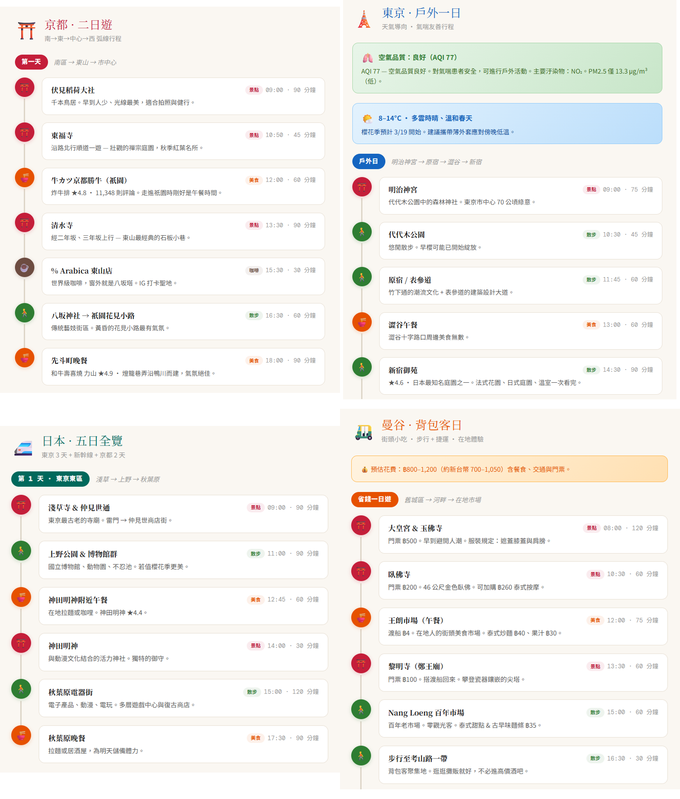

<p align="center">
  <a href="https://www.npmjs.com/package/@cablate/mcp-google-map"></a>
  <a href="https://www.npmjs.com/package/@cablate/mcp-google-map"></a>
  <a href="https://github.com/cablate/mcp-google-map/stargazers"></a>
  <a href="./LICENSE"></a>
</p>

<p align="center">
  
</p>

<h3 align="center"><b>讓你的 AI 代理理解真實世界 —<br>地理編碼、路線規劃、地點搜尋、空間推理。</b></h3>

<p align="center">
  <a href="./README.md">English</a> | <b>繁體中文</b>
</p>

<p align="center">
  
</p>

- **17 個工具** — 14 個原子工具 + 3 個組合工具（explore-area、plan-route、compare-places）
- **3 種模式** — stdio、StreamableHTTP、獨立 exec CLI
- **Agent Skill** — 內建技能定義，教 AI 如何串接地理工具（[`skills/google-maps/`](./skills/google-maps/)）

### vs Google Grounding Lite

| | 本專案 | [Grounding Lite](https://cloud.google.com/blog/products/ai-machine-learning/announcing-official-mcp-support-for-google-services) |
|---|---|---|
| 工具數 | **17** | 3 |
| 地理編碼 | 有 | 無 |
| 逐步導航 | 有 | 無 |
| 海拔查詢 | 有 | 無 |
| 距離矩陣 | 有 | 無 |
| 地點詳情 | 有 | 無 |
| 時區查詢 | 有 | 無 |
| 天氣查詢 | 有 | 有 |
| 空氣品質 | 有 | 無 |
| 地圖圖片 | 有 | 無 |
| 組合工具（探索、規劃、比較） | 有 | 無 |
| 開源 | MIT | 否 |
| 自架部署 | 有 | 僅 Google 託管 |
| Agent Skill | 有 | 無 |

### 快速開始

```bash
# stdio（Claude Desktop、Cursor 等）
npx @cablate/mcp-google-map --stdio

# exec CLI — 不需啟動 server
npx @cablate/mcp-google-map exec geocode '{"address":"台北101"}'

# HTTP server
npx @cablate/mcp-google-map --port 3000 --apikey "YOUR_API_KEY"
```

## 特別感謝

感謝 [@junyinnnn](https://github.com/junyinnnn) 協助實作 `streamablehttp` 支援。

## 可用工具

| 工具 | 說明 |
|------|------|
| `maps_search_nearby` | 依類型搜尋附近地點（餐廳、咖啡廳、飯店等），支援半徑、評分、營業中篩選 |
| `maps_search_places` | 自然語言地點搜尋（如「東京拉麵」），支援位置偏好、評分、營業中篩選 |
| `maps_place_details` | 以 place_id 取得地點完整資訊 — 評論、電話、網站、營業時間。可選 `maxPhotos` 參數取得照片 URL。 |
| `maps_geocode` | 將地址或地標名稱轉換為 GPS 座標 |
| `maps_reverse_geocode` | 將 GPS 座標轉換為街道地址 |
| `maps_distance_matrix` | 計算多個起點與終點間的旅行距離和時間 |
| `maps_directions` | 取得兩點間的逐步導航路線 |
| `maps_elevation` | 查詢地理座標的海拔高度（公尺） |
| `maps_timezone` | 查詢座標的時區 ID、名稱、UTC/DST 偏移量和當地時間 |
| `maps_weather` | 查詢當前天氣或預報 — 溫度、濕度、風速、紫外線、降水 |
| `maps_air_quality` | 查詢空氣品質指數、污染物濃度，以及各族群健康建議 |
| `maps_static_map` | 產生帶標記、路徑或路線的地圖圖片 — 直接內嵌在對話中 |
| `maps_batch_geocode` | 一次地理編碼最多 50 個地址 |
| `maps_search_along_route` | 搜尋兩點間路線沿途的地點 — 依最小繞路時間排序 |
| **組合工具** | |
| `maps_explore_area` | 一次呼叫探索某地周邊 — 搜尋多種地點類型並取得詳情 |
| `maps_plan_route` | 規劃最佳化多站路線 — 地理編碼、最佳順序、回傳導航 |
| `maps_compare_places` | 並排比較地點 — 搜尋、取得詳情，可選計算距離 |

所有工具標註 `readOnlyHint: true` 和 `destructiveHint: false` — MCP 客戶端可自動核准，無需使用者確認。

> **前置條件**：使用地點相關工具前，請在 [Google Cloud Console](https://console.cloud.google.com) 啟用 **Places API (New)**。

## 安裝

### 方法一：stdio（大多數客戶端推薦）

適用於 Claude Desktop、Cursor、VS Code 及任何支援 stdio 的 MCP 客戶端：

```json
{
  "mcpServers": {
    "google-maps": {
      "command": "npx",
      "args": ["-y", "@cablate/mcp-google-map", "--stdio"],
      "env": {
        "GOOGLE_MAPS_API_KEY": "YOUR_API_KEY"
      }
    }
  }
}
```

**減少上下文用量** — 如果只需要部分工具，設定 `GOOGLE_MAPS_ENABLED_TOOLS` 限制註冊的工具：

```json
{
  "env": {
    "GOOGLE_MAPS_API_KEY": "YOUR_API_KEY",
    "GOOGLE_MAPS_ENABLED_TOOLS": "maps_geocode,maps_directions,maps_search_places"
  }
}
```

不設定或設為 `*` 即啟用全部 17 個工具（預設）。

### 方法二：HTTP Server

適用於多 session 部署、per-request API key 隔離或遠端存取：

```bash
npx @cablate/mcp-google-map --port 3000 --apikey "YOUR_API_KEY"
```

然後設定你的 MCP 客戶端：

```json
{
  "mcpServers": {
    "google-maps": {
      "type": "http",
      "url": "http://localhost:3000/mcp"
    }
  }
}
```

### Server 資訊

- **傳輸方式**：stdio（`--stdio`）或 Streamable HTTP（預設）
- **工具數**：17 個 Google Maps 工具（14 原子 + 3 組合）— 可透過 `GOOGLE_MAPS_ENABLED_TOOLS` 篩選

### CLI Exec 模式（Agent Skill）

不啟動 MCP server，直接使用工具：

```bash
npx @cablate/mcp-google-map exec geocode '{"address":"台北101"}'
npx @cablate/mcp-google-map exec search-places '{"query":"東京拉麵"}'
```

全部 17 個工具可用：`geocode`、`reverse-geocode`、`search-nearby`、`search-places`、`place-details`、`directions`、`distance-matrix`、`elevation`、`timezone`、`weather`、`air-quality`、`static-map`、`batch-geocode-tool`、`search-along-route`、`explore-area`、`plan-route`、`compare-places`。完整參數文件見 [`skills/google-maps/`](./skills/google-maps/)。

### 批次地理編碼

從檔案批次地理編碼：

```bash
npx @cablate/mcp-google-map batch-geocode -i addresses.txt -o results.json
cat addresses.txt | npx @cablate/mcp-google-map batch-geocode -i -
```

輸入：每行一個地址。輸出：JSON `{ total, succeeded, failed, results[] }`。預設並行度：20。

### API Key 設定

API key 可透過三種方式提供（優先順序）：

1. **HTTP Headers**（最高優先）

   ```json
   {
     "mcp-google-map": {
       "transport": "streamableHttp",
       "url": "http://localhost:3000/mcp",
       "headers": {
         "X-Google-Maps-API-Key": "YOUR_API_KEY"
       }
     }
   }
   ```

2. **命令列參數**

   ```bash
   mcp-google-map --apikey YOUR_API_KEY
   ```

3. **環境變數**（.env 檔案或命令列）
   ```env
   GOOGLE_MAPS_API_KEY=your_api_key_here
   MCP_SERVER_PORT=3000
   ```

## 開發

### 本地開發

```bash
# 複製專案
git clone https://github.com/cablate/mcp-google-map.git
cd mcp-google-map

# 安裝依賴
npm install

# 設定環境變數
cp .env.example .env
# 編輯 .env 填入你的 API key

# 建置專案
npm run build

# 啟動 server
npm start

# 或以開發模式執行
npm run dev
```

### 測試

```bash
# 執行 smoke tests（基本測試不需要 API key）
npm test

# 執行完整 E2E 測試（需要 GOOGLE_MAPS_API_KEY）
npm run test:e2e
```

### 專案結構

```
src/
├── cli.ts                        # CLI 進入點
├── config.ts                     # 工具註冊與 server 設定
├── index.ts                      # 套件匯出
├── core/
│   └── BaseMcpServer.ts          # MCP server（streamable HTTP 傳輸）
├── services/
│   ├── NewPlacesService.ts       # Google Places API (New) 客戶端
│   ├── PlacesSearcher.ts         # Service facade 層
│   └── toolclass.ts              # Legacy Google Maps API 客戶端
├── tools/
│   └── maps/
│       ├── searchNearby.ts       # maps_search_nearby 工具
│       ├── searchPlaces.ts       # maps_search_places 工具
│       ├── placeDetails.ts       # maps_place_details 工具
│       ├── geocode.ts            # maps_geocode 工具
│       ├── reverseGeocode.ts     # maps_reverse_geocode 工具
│       ├── distanceMatrix.ts     # maps_distance_matrix 工具
│       ├── directions.ts         # maps_directions 工具
│       ├── elevation.ts          # maps_elevation 工具
│       ├── timezone.ts           # maps_timezone 工具
│       ├── weather.ts            # maps_weather 工具
│       ├── airQuality.ts         # maps_air_quality 工具
│       ├── staticMap.ts          # maps_static_map 工具
│       ├── batchGeocode.ts       # maps_batch_geocode 工具
│       ├── searchAlongRoute.ts   # maps_search_along_route 工具
│       ├── exploreArea.ts        # maps_explore_area（組合）
│       ├── planRoute.ts          # maps_plan_route（組合）
│       └── comparePlaces.ts      # maps_compare_places（組合）
└── utils/
    ├── apiKeyManager.ts          # API key 管理
    └── requestContext.ts         # Per-request context（API key 隔離）
tests/
└── smoke.test.ts                 # Smoke + E2E 測試套件
skills/
├── google-maps/                  # Agent Skill — 如何使用工具
│   ├── SKILL.md                  # 工具對照表、場景食譜、呼叫方式
│   └── references/
│       ├── tools-api.md          # 工具參數 + 場景食譜
│       ├── travel-planning.md    # 旅行規劃方法論
│       └── local-seo.md          # Local SEO / Google 商家排名分析
└── project-docs/                 # Project Skill — 如何開發/維護
    ├── SKILL.md                  # 架構概覽 + 入門指南
    └── references/
        ├── architecture.md       # 系統設計、code map、9 檔案 checklist
        ├── google-maps-api-guide.md  # API 端點、定價、注意事項
        ├── geo-domain-knowledge.md   # GIS 基礎、日本場景
        └── decisions.md          # 10 個 ADR（設計決策 + 理由）
```

## 技術棧

- **TypeScript** - 型別安全開發
- **Node.js** - 執行環境
- **@googlemaps/places** - Google Places API (New) 地點搜尋與詳情
- **@googlemaps/google-maps-services-js** - Legacy API 地理編碼、導航、距離矩陣、海拔
- **@modelcontextprotocol/sdk** - MCP 協議實作（v1.27+）
- **Express.js** - HTTP server 框架
- **Zod** - Schema 驗證

## 安全性

- API key 在 server 端處理
- 多租戶部署的 per-session API key 隔離
- 正式環境可啟用 DNS rebinding 防護
- 使用 Zod schemas 進行輸入驗證

企業安全審查請參考 [Security Assessment Clarifications](./SECURITY_ASSESSMENT.md) — 涵蓋授權、資料保護、憑證管理、工具污染、AI 代理執行環境驗證的 23 項檢查清單。

## 路線圖

### 近期新增

| 工具 / 功能 | 解鎖場景 | 狀態 |
|------|----------------|--------|
| `maps_static_map` | 帶標記/路線的地圖圖片 — 多模態 AI 可「看見」地圖 | **完成** |
| `maps_air_quality` | AQI、污染物 — 健康出行、戶外規劃 | **完成** |
| `maps_batch_geocode` | 一次地理編碼最多 50 個地址 — 資料增強 | **完成** |
| `maps_search_along_route` | 沿路線搜尋地點，依繞路時間排序 — 旅行規劃 | **完成** |
| `maps_explore_area` | 一次呼叫的社區概覽（組合工具） | **完成** |
| `maps_plan_route` | 最佳化多站行程（組合工具） | **完成** |
| `maps_compare_places` | 並排地點比較（組合工具） | **完成** |
| `GOOGLE_MAPS_ENABLED_TOOLS` | 篩選工具以減少上下文用量 | **完成** |

### 計畫中

| 功能 | 解鎖場景 | 狀態 |
|---------|----------------|--------|
| `maps_place_photo` | 地點照片供多模態 AI 使用 — 「看見」餐廳氛圍 | 計畫中 |
| 語言參數 | 所有工具支援多語言回應（ISO 639-1） | 計畫中 |
| MCP Prompt Templates | Claude Desktop 中的 `/travel-planner`、`/neighborhood-scout` 斜線指令 | 計畫中 |
| Geo-Reasoning Benchmark | 10 場景測試套件，衡量 LLM 地理空間推理準確度 | 研究中 |

### 我們在建構的應用場景

以下是驅動工具開發方向的真實場景：

- **旅行規劃** — 「規劃東京一日遊」（geocode → search → directions → weather）
- **房地產分析** — 「分析這個社區：學校、通勤、洪水風險」（search-nearby × N + elevation + distance-matrix）
- **物流優化** — 「從倉庫出發，最佳化這 12 個配送地址的路線」（plan-route）
- **外勤銷售** — 「拜訪芝加哥 6 個客戶，最小化車程，找午餐地點」（plan-route + search-nearby）
- **災害應變** — 「最近有開的醫院？我在洪水區嗎？」（search-nearby + elevation）
- **內容創作** — 「Austin 前 5 社區的餐廳密度和機場距離」（explore-area + distance-matrix）
- **無障礙** — 「輪椅可達的餐廳，避開陡坡路線」（search-nearby + place-details + elevation）
- **Local SEO** — 「分析我的餐廳在 1 公里內跟競爭對手的排名差距」（search-places + compare-places + explore-area）

## 更新日誌

見 [CHANGELOG.md](./CHANGELOG.md)。

## 授權

MIT

## 貢獻

歡迎社群參與和貢獻！

- 提交 Issue：回報 bug 或提供建議
- 建立 Pull Request：提交程式碼改進
- 文件：協助改善文件

## 聯絡

- Email: [reahtuoo310109@gmail.com](mailto:reahtuoo310109@gmail.com)
- GitHub: [CabLate](https://github.com/cablate/)

## Star History

<a href="https://glama.ai/mcp/servers/@cablate/mcp-google-map">
  
</a>

[](https://www.star-history.com/#cablate/mcp-google-map&Date)
