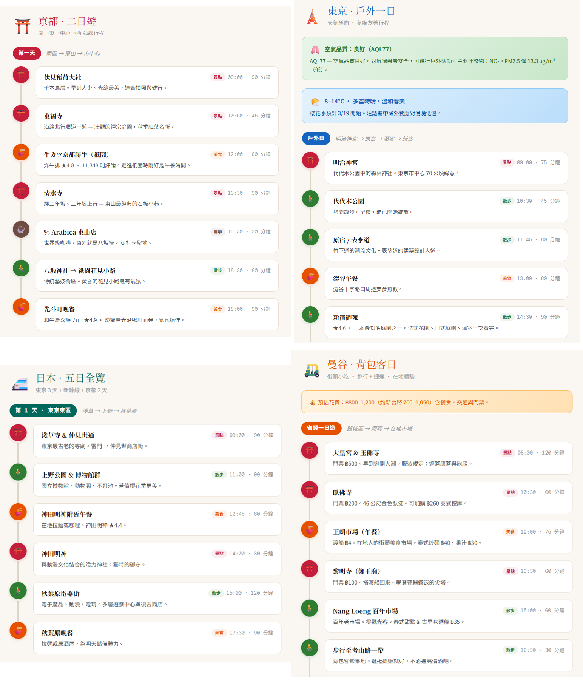

# 給 AI 代理使用的 Google Maps

**不用再為每一個 AI 應用重做地點搜尋、路線與位置工作流程。**

`@cablate/mcp-google-map` 將 Google Maps Platform 整理成 18 個唯讀代理工具與三個用途明確的 Skills。代理可以搜尋真實地點、驗證路線、比較選項、建立可執行的旅行計畫，或分析在地搜尋能見度；既可透過 MCP，也可直接使用獨立 CLI。

整合方式由你決定：不想設定 MCP 時安裝 Codex Plugin；桌面 MCP client 使用 stdio；共享或遠端部署則使用 Streamable HTTP。

<p align="center"><a href="./README.md">English</a> · <b>繁體中文</b></p>

<p align="center"></p>

<p align="center">
  <a href="https://www.npmjs.com/package/@cablate/mcp-google-map"></a>
  <a href="https://www.npmjs.com/package/@cablate/mcp-google-map"></a>
  <a href="https://github.com/cablate/mcp-google-map/actions/workflows/ci.yml"></a>
  <a href="./LICENSE"></a>
</p>

## 為什麼要用？

把原始 Maps API 交給代理只是第一步。真正有用的答案通常依賴一連串呼叫：確認地點、保留同一個地點的識別資訊、搜尋周邊、檢查營業資料、計算旅行時間，再清楚說明哪些內容真的驗證過。本專案把這些工作整理成一致的介面。

- **從單次查詢走到可用成果。** 原子工具處理地址解析、地點詳情、導航、天氣、空氣品質與地圖；組合工具可探索區域、比較候選地點、最佳化停靠順序與分析在地排名。
- **同一套能力可用或不用 MCP。** 獨立 `exec` CLI 適合 Agent Skills 與自動化；MCP server 則透過 stdio 或 HTTP 暴露相同的 18 個工具。
- **不只提供函式名稱，也提供代理工作方法。** 三個 Skills 分別處理一般地圖研究、具證據的旅行規劃與 Local SEO。Codex 只有在請求符合時才載入完整指令。
- **部署方式與憑證仍由你控制。** 可在本機執行或自行架設；API key 保留在環境變數或 request header，HTTP 部署亦支援每個 session 隔離。
- **可以先小規模導入。** 透過 `GOOGLE_MAPS_ENABLED_TOOLS` 只註冊需要的工具，也可直接使用完整工具集。

<p align="center"></p>

## 代理能完成什麼？

| 成果 | 本專案提供的能力 |
|---|---|
| 搜尋並評估真實地點 | 自然語言與附近搜尋、地點詳情、評分、營業時間、評論與距離比較 |
| 建立地理上可執行的行程 | 候選地點探索、沿途停靠點、旅行時間檢查、多站最佳化、天氣與靜態地圖 |
| 研究一個區域 | 多類別區域探索，加上距離、海拔、時區、天氣與空氣品質查詢 |
| 規劃外勤或配送 | 路線矩陣，以及最多 25 個停靠點的順序最佳化 |
| 分析在地搜尋能見度 | 地理網格排名、競爭者探索、ARP、ATRP 與 SoLV 指標 |
| 補全位置資料 | 單筆或批次地址解析、反向地址解析與結構化 JSON 輸出 |

這些是資料與規劃工具，不保證安全、無障礙、即時營業狀態或排名成果。應用程式若顯示 Places 評論、照片或 AI 摘要，必須遵守[內容署名與保存指引](./skills/_shared/content-attribution.md)。

## 選擇整合方式

| 使用方式 | 適合情境 | 實際執行內容 |
|---|---|---|
| **Codex Plugin** | 不設定 MCP，直接讓 Codex 回答地圖、旅行或 Local SEO 問題 | 符合請求的 Skill 按需載入並呼叫獨立 CLI |
| **獨立 CLI** | 腳本、自動化與其他支援 Skill 的代理 | 單次無狀態命令回傳 JSON |
| **MCP stdio** | Claude Desktop、Cursor、VS Code 與其他本機 MCP clients | Client 啟動本機 MCP 程序 |
| **Streamable HTTP** | 多 session、容器、區域網路或遠端存取 | 自架 server 暴露 `/mcp` |

所有方式都需要 Node.js 18+ 與 Google Maps Platform API key，實際 API 呼叫可能產生費用。請啟用所選工具需要的 API；常見地點與路線流程會使用 **Places API (New)**、**Routes API**，通常也需要 **Geocoding API**。

## 從 Codex 開始，不需要 MCP

```bash
codex plugin marketplace add cablate/mcp-google-map --ref main
codex plugin add mcp-google-map@cablate
```

在 Codex 的執行環境設定 `GOOGLE_MAPS_API_KEY`，再開啟新對話。先檢查本機環境，不會送出 Google API 請求：

```bash
npx -y @cablate/mcp-google-map doctor
```

成功時，`node`、`package` 與 `api-key` 檢查會通過，`live-api` 會略過。只有在你確定要送出可能計費的 Geocoding、Places 與 Routes 測試時，才使用 `doctor --live`。

可以直接問：

> 規劃一個實際可行的京都兩日行程。把鄰近地點排在一起、檢查交通時間，並說明營業時間有哪些假設。

Codex 會依請求選擇一般地圖研究、旅行規劃或 Local SEO Skill。Plugin 不會註冊或啟動 MCP server。可參考[非 MCP 完整示範](./examples/agent-skill-demo.md)重現整個流程。

## 使用獨立 CLI

每一個 MCP 工具都有簡短的 CLI 名稱：

```bash
npx -y @cablate/mcp-google-map exec geocode '{"address":"台北101"}'
npx -y @cablate/mcp-google-map exec search-places '{"query":"京都安靜的咖啡廳"}'
npx -y @cablate/mcp-google-map exec directions '{"origin":"台北車站","destination":"台北101","mode":"transit"}'
```

每次呼叫皆為無狀態。成功時在 stdout 回傳 `{ "success": true, "data": ... }`；失敗時以非零狀態結束，並在 stderr 輸出結構化 JSON。

批次補全地址可使用：

```bash
npx @cablate/mcp-google-map batch-geocode -i addresses.txt -o results.json
cat addresses.txt | npx @cablate/mcp-google-map batch-geocode -i -
```

## 連接 MCP client

### stdio

```json
{
  "mcpServers": {
    "google-maps": {
      "command": "npx",
      "args": ["-y", "@cablate/mcp-google-map", "--stdio"],
      "env": { "GOOGLE_MAPS_API_KEY": "YOUR_API_KEY" }
    }
  }
}
```

若要減少工具清單占用的上下文，可加入 `"GOOGLE_MAPS_ENABLED_TOOLS": "maps_geocode,maps_directions,maps_search_places"`。不設定或使用 `*` 即暴露全部工具。

### Streamable HTTP

```bash
npx @cablate/mcp-google-map --host 127.0.0.1 --port 3000 --apikey "YOUR_API_KEY"
```

```json
{
  "mcpServers": {
    "google-maps": {
      "type": "http",
      "url": "http://127.0.0.1:3000/mcp"
    }
  }
}
```

只有 server 確實需要接受外部連線時才綁定 `0.0.0.0`。多租戶部署建議使用 `X-Google-Maps-API-Key` request header，讓不同 session 的 key 保持隔離。

## 工具目錄

| 分類 | 工具 |
|---|---|
| 地點與探索 | `maps_search_places`、`maps_search_nearby`、`maps_place_details`、`maps_explore_area`、`maps_compare_places`、`maps_search_along_route` |
| 位置與路線 | `maps_geocode`、`maps_reverse_geocode`、`maps_directions`、`maps_distance_matrix`、`maps_plan_route`、`maps_batch_geocode` |
| 環境資訊與視覺化 | `maps_elevation`、`maps_timezone`、`maps_weather`、`maps_air_quality`、`maps_static_map` |
| Local SEO | `maps_local_rank_tracker` |

全部 18 個工具都宣告 `readOnlyHint: true` 與 `destructiveHint: false`。完整參數、回應格式與工作流程範例見[工具參考](./skills/google-maps/references/tools-api.md)。

## API key 與 Google Cloud 設定

API key 所屬的 Google Cloud project 必須已啟用 billing，且 key restrictions 要與執行環境相容。[設定與診斷指南](./skills/_shared/setup-and-diagnostics.md)列出每項能力需要的 API，以及常見錯誤的處理方式。

憑證優先順序如下：

1. `X-Google-Maps-API-Key` HTTP request header
2. `--apikey` 命令列參數
3. `GOOGLE_MAPS_API_KEY` 環境變數

建議使用環境變數或 request header。命令列中的秘密可能出現在 shell 歷史或程序清單。

## 信任與限制

- 地點與路線事實來自你為專案啟用的 Google Maps Platform APIs；天氣服務有區域限制。
- API 成功回應不等於已證明無障礙、安全、法律適用性或即時可用性。
- 套件會保留 API 回傳的來源與揭露 metadata，但你的介面仍有責任符合署名與保存規範。
- HTTP 模式支援每個 session 的 API key 隔離與 DNS rebinding 防護。
- 本專案採 MIT 授權且可自行架設。漏洞回報請見 [SECURITY.md](./SECURITY.md)；企業審查可參考 [Security Assessment Clarifications](./SECURITY_ASSESSMENT.md)。

## 開發

```bash
git clone https://github.com/cablate/mcp-google-map.git
cd mcp-google-map
npm ci
npm run build
npm run test:unit
npm test
```

即時 E2E 呼叫需要 `GOOGLE_MAPS_API_KEY`，且可能計費：`npm run test:e2e`。

歡迎參與貢獻。送出 pull request 前請先閱讀 [CONTRIBUTING.md](./CONTRIBUTING.md)；版本紀錄見 [CHANGELOG.md](./CHANGELOG.md)。

## 特別感謝

感謝 [@junyinnnn](https://github.com/junyinnnn) 協助加入 Streamable HTTP 支援。

## 授權

[MIT](./LICENSE)
